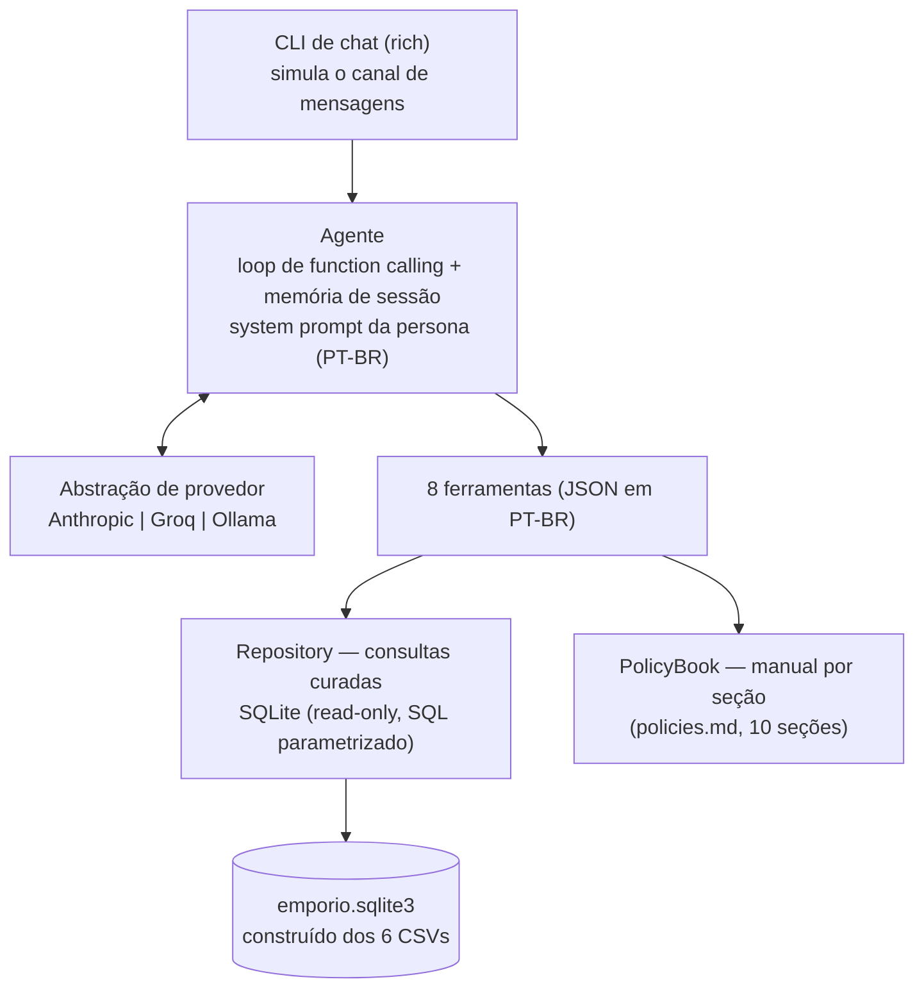

# 🎸 Empório da Música — Agente de Atendimento

Protótipo de um **agente de atendimento por mensagens de texto** para a loja fictícia
Empório da Música (Campo Grande/MS), desenvolvido para o desafio técnico de
**AI Engineer da Artefact**.

O agente assume a persona de atendente da loja e conversa em português, decidindo
sozinho quando consultar **dados operacionais** (produtos, estoque, preços, promoções,
pedidos — via ferramentas sobre SQLite) e quando consultar o **manual de políticas**
(trocas, pagamento, frete, garantia — via consulta por seção), com tratamento explícito
para perguntas fora do escopo, verificação de identidade (LGPD) e resistência a
injeção de prompt.

**Validação:** 81 testes unitários + [suíte comportamental com o agente real:
**16/16 cenários**](docs/eval_results.md), incluindo as inconsistências plantadas nos
dados do desafio.

---

## Como executar

Pré-requisitos: **Python 3.11+** e **git**. O projeto usa [uv](https://docs.astral.sh/uv/)
(instalável com `pip install uv`).

```bash
git clone https://github.com/pedroseagridf/emporio-agent.git
cd emporio-agent
python -m uv sync
```

Configure o provedor do modelo (arquivo `.env`):

```bash
cp .env.example .env   # Windows: copy .env.example .env
```

| Provedor (`LLM_PROVIDER`) | Custo | Chave (`LLM_API_KEY`) | Modelo padrão |
|---|---|---|---|
| `groq` ✅ *recomendado para avaliação* | **Gratuito** (camada free) | [console.groq.com](https://console.groq.com) → API Keys | `openai/gpt-oss-120b` |
| `anthropic` | Pago por uso (centavos) | [console.anthropic.com](https://console.anthropic.com) | `claude-haiku-4-5` |
| `ollama` | Gratuito (local) | não precisa | `qwen2.5:14b` |

Edite o `.env` com `LLM_PROVIDER` e a chave, e converse com o agente:

```bash
python -m uv run emporio-agent
```

A base SQLite é construída automaticamente na primeira execução (ou manualmente com
`python -m uv run python -m emporio_agent.db.build_db`). Comandos no chat: `/reset`,
`/ajuda`, `/sair`. Cada resposta exibe as ferramentas que o agente consultou.

**Testes:**

```bash
python -m uv run pytest -m "not llm"   # 81 testes unitários — sem chave, sem custo
python -m uv run pytest tests/eval     # 16 cenários com o agente real (usa a chave do .env)
```

A suíte comportamental regenera [docs/eval_results.md](docs/eval_results.md) a cada
execução. Os exemplos de conversa podem ser regenerados com
`python -m uv run python scripts/gera_exemplos.py`.

---

## Arquitetura



### Decisões técnicas e alternativas rejeitadas

| Decisão | Alternativas rejeitadas | Justificativa |
|---|---|---|
| **Function calling nativo** | ReAct textual; text-to-SQL livre | O requisito central — "saber quando consultar dados e quando consultar políticas" — mapeia 1:1 para seleção de ferramentas. Parsing determinístico, sem regex sobre texto do modelo. SQL livre gerado por LLM é imprevisível demais para um bot de cliente. |
| **Loop de agente próprio (~100 linhas)** | LangChain/LangGraph; tool runners dos SDKs | Formato neutro de mensagens permite trocar Anthropic ↔ Groq ↔ Ollama por variável de ambiente, sem reescrever nada. Todo o fluxo é inspecionável e testável com provedor fake. Frameworks adicionariam dependências e camadas de indireção sem ganho neste escopo. |
| **SQLite + funções de consulta curadas** | pandas em memória; "agente SQL" com query livre | Regras de negócio (promoção ativa, verificação de identidade, similares) ficam em código **testável sem LLM** — 81 testes cobrem cada pegadinha dos dados. Conexão read-only e SQL 100% parametrizado. |
| **Políticas por seção (sem vector DB)** | RAG com embeddings + vector store | O manual tem ~4 mil tokens. Embeddings aqui seriam over-engineering: a consulta por seção numerada é exata, citável e sem risco de retrieval errado. Com um corpus 10× maior (vários manuais), a decisão inverte — o `PolicyBook` é o ponto de troca. |
| **Modelos pequenos/gratuitos por padrão** | Modelos topo de linha | O avaliador roda o projeto **sem custo** (Groq free). A suíte comportamental comprova qualidade suficiente — 16/16 até no `gpt-oss-20b`. Trocar de modelo é uma linha no `.env`. |
| **Verificação de identidade para pedidos** | Responder direto ao número do pedido | LGPD (§9 do manual) + a base tem clientes homônimos ("Bruno Carvalho Martins" / "Bruno Carvalho" / "Bruno Martins"). Exige nº do pedido + nome do titular, ou nome + contato cadastrado; respostas neutras impedem enumeração de pedidos. |
| **Memória em sessão, sem persistência em disco** | Histórico em SQLite | Protótipo de CLI single-user: persistir não melhora a experiência avaliada. Num canal real, a sessão seria por contato de WhatsApp — listado em próximos passos. |

### Estratégia de prompt

O [system prompt](src/emporio_agent/prompts/system.md) (versionado como arquivo, não
string no código) codifica o manual da loja: persona e tom (§7.1), fluxo de
atendimento em 5 passos (§7.2), situações especiais (§7.3), regras de promoção não
cumulativas (§6.2) e a **regra de ouro anti-alucinação**: nenhum preço, estoque,
promoção ou pedido é afirmado sem vir de ferramenta na própria conversa — a única
aritmética permitida é o desconto PIX à vista. Data/hora em PT-BR são injetadas a
cada mensagem (regra de fora-do-expediente). Duas instruções nasceram de depuração
com o modelo real (P10): explicar a regra antes de coletar dados do cliente, e a
proibição de calcular parcelas.

---

## Tratamento de dados

Os 6 CSVs são carregados em SQLite por ingestão idempotente que **não altera os dados
originais** — inconsistências são resolvidas na camada de consulta ou de prompt, onde
a decisão fica explícita e testável. A auditoria encontrou 11 pontos de atenção
(produto ativo com estoque 0, descontinuados, 21 de 25 promoções expiradas,
divergências nome × descrição, totais de pedido que não batem com os itens, clientes
homônimos, categorias vazias): tabela completa *achado → decisão → teste* em
[docs/data_notes.md](docs/data_notes.md).

## Suposições

O enunciado orienta assumir interpretações razoáveis e documentá-las:

| # | Suposição | Justificativa |
|---|---|---|
| AS-1 | Agente conversa em **PT-BR**, tom informal-profissional | Público brasileiro; tom definido no manual (§7.1) |
| AS-2 | Consulta de pedido exige **verificação leve de identidade** | LGPD (§9) + homônimos na base; partículas ("da") não contam como sobrenome |
| AS-3 | Telefone/WhatsApp oficial: **(67) 3341-4444** | O manual traz dois números sem conciliá-los (§1.2 vs §7); o segundo é tratado como o canal onde o agente opera |
| AS-4 | E-mail: **contato@emporiodamusica.com.br** | A grafia acentuada da tabela 1.2 do manual não é um e-mail válido |
| AS-5 | Em divergência, **`name` + `specs` são a fonte de verdade** do produto | Descrições contêm trocas evidentes de marca/modelo (auditoria D1) |
| AS-6 | Integração real com WhatsApp **fora do escopo** | O enunciado pede protótipo com foco no agente; a CLI simula o canal |

## Qualidade, segurança e custo

- **Revisão adversarial** (playbook P07): um agente de contexto limpo revisou todo o
  código e verificou cada suspeita executando-a; 18 achados (3 críticos) corrigidos
  com testes de regressão — relatório em [docs/review_findings.md](docs/review_findings.md).
- **Segurança**: SQL 100% parametrizado com conexão read-only; escape de curingas no
  LIKE; payloads de pedido expõem só o primeiro nome do cliente (minimização de
  dados); mensagens neutras anti-enumeração; casos de injeção de prompt e vazamento
  cobertos pela suíte comportamental; nenhum segredo no repositório (`.env` ignorado).
- **Custo/desempenho**: prompt de sistema + ferramentas ≈ 2,5 mil tokens por chamada;
  um turno típico usa 1–3 chamadas (~3–9 mil tokens). Na Groq free o custo é zero; no
  Claude Haiku, décimos de centavo por conversa. Retry com backoff apenas para erros
  transitórios (401/403/404 falham imediatamente).

## Limitações conhecidas (e o que eu faria com mais tempo)

- **Instalação via wheel não funciona fora do clone** — os dados (`data/`) ficam fora
  do pacote; o protótipo pressupõe o repositório clonado.
- **Datas dos dados**: os pedidos do dataset são de 2025-2026 e "hoje" é a data real
  do sistema — prazos calculados sobre pedidos antigos refletem isso.
- **Sem streaming de resposta** na CLI (a resposta chega inteira).
- **Escalação a humano é simulada** (o agente promete encaminhar; não há fila real).
- **Suíte comportamental sujeita a rate limit** da camada gratuita (documentado em
  `docs/eval_results.md` — a execução final rodou no `gpt-oss-20b` por cota diária).
- Com mais tempo: adapter de WhatsApp (sessão por contato + persistência de histórico),
  RAG com embeddings quando o corpus de políticas crescer, avaliação LLM-as-judge
  complementando as asserções, tracing/observabilidade (OpenTelemetry), Dockerfile e
  CI (GitHub Actions com `pytest -m "not llm"` + ruff).

## Uso de assistentes de IA

Este projeto foi construído em par com o **Claude (Claude Code)**, num fluxo
deliberadamente estruturado — e documentado no próprio repositório:

1. **Planejamento em 3 fases** antes de qualquer código ([docs/planning/](docs/planning/)):
   análise completa do caso (incluindo a auditoria que achou as pegadinhas nos dados),
   plano de execução com fases/marcos/riscos, e um **playbook de 15 prompts** (P01–P15)
   cobrindo entendimento → arquitetura → código → revisão → testes → depuração →
   documentação → entrega.
2. **Execução por fases com validação humana**: cada fase do playbook foi executada
   pelo assistente e revisada/aprovada antes da seguinte, com commits incrementais
   narrando o progresso real (nenhum force-push).
3. **IA revisando IA**: a revisão adversarial (P07) foi feita por um agente de
   contexto limpo, instruído a *verificar cada suspeita executando o código* — os 18
   achados e suas correções estão em [docs/review_findings.md](docs/review_findings.md).
4. **Depuração com causa-raiz** (P10): falhas da suíte comportamental foram
   diagnosticadas antes de corrigir — 2 viraram melhorias de prompt, 1 era asserção
   errada do teste (a correção certa foi no teste, não no agente).

O papel humano no fluxo: decisões de escopo, validação de cada fase, gestão de
credenciais e a palavra final em cada correção aplicada.

## Exemplos de interação

Transcrições reais (geradas com o agente conectado, ferramentas anotadas por turno)
em [`examples/`](examples/):

1. [Busca no catálogo com filtro de preço](examples/01_catalogo_violoes.md)
2. [Política de trocas e devoluções](examples/02_politica_devolucao.md)
3. [**Não trivial** — pedido com verificação de identidade (LGPD)](examples/03_pedido_com_verificacao.md)
4. [**Não trivial** — promoção expirada + produto sem estoque](examples/04_promocao_expirada_sem_estoque.md)
5. [Escopo da loja e redirecionamento](examples/05_escopo_e_redirecionamento.md)
